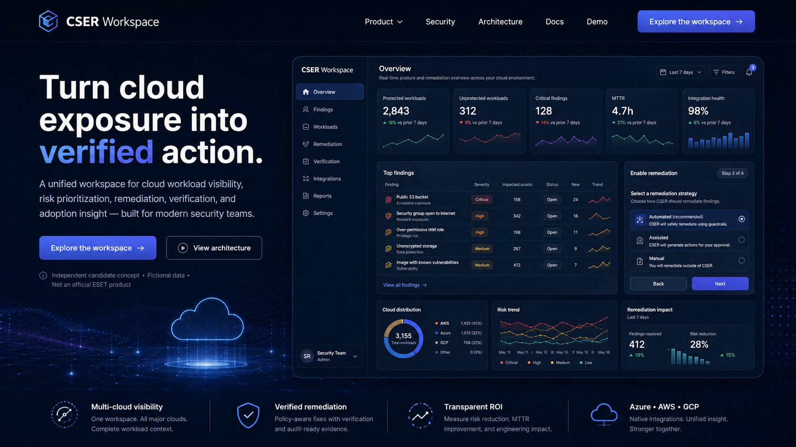

# CSER Workspace V3 — ESET Candidate Edition

Independent React/TypeScript full-stack cloud-security candidate MVP using fictional Azure, AWS and GCP data.

> **Truth boundary:** This is an independent candidate concept. It is not an official ESET product, does not use internal ESET systems or APIs, does not scan real clouds, and must not be used with real enterprise security data without further security and operational review.



## What V3 demonstrates

- React SPA built for Vite with local package dependencies
- strict TypeScript source without a JSX/`any` escape hatch
- React Router and TanStack Query
- modular NestJS REST API source
- PostgreSQL and Prisma data model
- tenant-scoped authorization and role-specific object scope
- explicit finding commands instead of arbitrary status changes
- `If-Match` optimistic concurrency and idempotency design
- deterministic 10,000-workload / 2,500-finding seed generator
- remediation, evidence notes, independent verification and risk acceptance
- protection enablement simulation and provider health
- transparent illustrative ROI/adoption scenarios
- Playwright and axe test specifications
- Docker Compose and Vercel/persistent-API deployment profiles

## Current delivery classification

This repository is a **source-complete V3 migration candidate with a preserved functional V2 reference preview**.

The source was generated and statically syntax-checked in a sandbox with no access to the npm registry, Docker daemon, PostgreSQL or a browser runtime. Therefore the following release gates remain **unexecuted**:

- dependency resolution and committed `pnpm-lock.yaml`;
- full TypeScript typecheck against installed packages;
- Prisma client generation and migration generation;
- PostgreSQL seed and invariant execution;
- NestJS and Vite builds;
- Playwright and axe execution;
- Docker image build and Compose startup;
- public deployment.

Do not call this repository submission-ready until `docs/RELEASE_GATE.md` is completed with passing evidence.

## Target V3 quick start

Prerequisites: Node.js 22+, Corepack, Docker with Compose.

```bash
corepack enable
pnpm install --no-frozen-lockfile
pnpm db:generate
pnpm db:migrate:dev --name initial_v3
pnpm db:seed
pnpm db:verify
pnpm dev
```

Web: `http://localhost:5173`  
API: `http://localhost:4000/api/docs`

After the first successful install, commit the generated `pnpm-lock.yaml` and switch all CI/Docker installs to `--frozen-lockfile`.

## Docker target

```bash
docker compose up --build
```

The Docker profile is present but must be executed before claiming Docker readiness.

## Functional V2 reference preview

The preserved V2 reference is included only as a runnable regression and visual-flow reference:

```bash
cd legacy/v2-reference
npm run verify
npm start
```

Open `http://127.0.0.1:4173`.

V2 is not the final architecture and remains clearly isolated from V3 runtime source.

## Demo identities

| Identity | Role | Tenant |
|---|---|---|
| Sofia Marin | Security Analyst | Northstar |
| Lukas Novak | Cloud Operations | Northstar |
| Petra Horak | Security Manager | Northstar |
| Martin Sykora | Read-only Auditor | Northstar |
| Alex Reed | Platform Admin | Northstar |
| Nina Carter | Security Analyst | BluePeak |

All identities and organizations are fictional.

## Golden workflow

1. Sofia opens `FND-CRIT-0042` and triages it.
2. Sofia assigns it to Lukas with an SLA and remediation summary.
3. Lukas starts remediation, captures structured fictional evidence and requests review.
4. Sofia independently verifies the critical finding.
5. Sofia resolves it.
6. The audit explorer shows each server-side command.
7. Alex demonstrates the enablement wizard and integration failure/retry states.
8. Petra demonstrates transparent business-impact assumptions.

## Repository map

```text
apps/web          React + Vite candidate UI
apps/api          NestJS typed REST API source
packages/contracts Shared DTO/domain contracts
packages/domain    Pure rules and formulas
prisma             PostgreSQL schema, seed and invariants
 tests/e2e          Playwright and axe specifications
infra              Nginx and deployment assets
legacy/v2-reference Preserved runnable V2 reference
docs               Architecture, migration, tests and boundaries
```

## Verification

Static verification that does not require external packages:

```bash
node scripts/static-verify.mjs
```

Full target release gate after dependencies and infrastructure are available:

```bash
pnpm db:generate
pnpm db:migrate:dev --name initial_v3
pnpm db:seed
pnpm db:verify
pnpm lint
pnpm typecheck
pnpm test
pnpm build
pnpm test:e2e
pnpm test:a11y
docker compose build
docker compose up -d
```

See `docs/RELEASE_GATE.md`, `docs/TEST_REPORT.md` and `docs/IMPLEMENTATION_REPORT.md` for the honest status of every gate.
