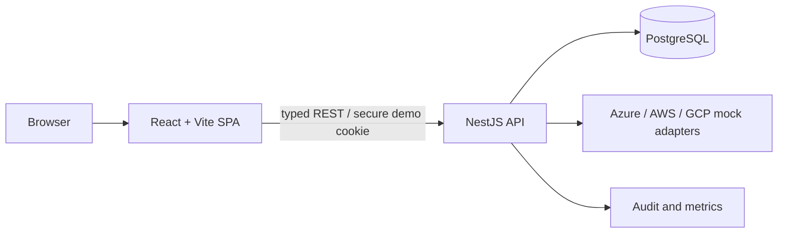

# Architecture

## Context

CSER Workspace V3 is a candidate-grade modular monolith. It models a multi-tenant cloud-security operations workspace using only fictional data and deterministic provider adapters.

## Boundaries

### Web

- route composition and accessible product UI;
- TanStack Query owns server state;
- typed contracts from `@cser/contracts`;
- no Prisma or provider payload imports;
- conflict recovery for ETag failures.

### API

- NestJS controllers handle transport only;
- services enforce tenant, role, object and state rules;
- Prisma repositories always include `tenantId`;
- commands atomically update workflow, audit, version and idempotency result.

### Data

PostgreSQL is the target source of truth. Every tenant-owned entity contains a tenant identifier. The seed uses domain-consistent factories and the invariant verifier must report zero violations.

### Provider adapters

V3 contains a deterministic mock-provider boundary. Real cloud SDK access is explicitly excluded. Healthy, stale, degraded, rate-limited, auth-error and partial-failure modes are designed as first-class product states.

## Authentication

Demo mode uses a signed HTTP-only server cookie and seeded memberships. An OIDC adapter is a production-hardening seam. Demo role switching creates a server session; the frontend cannot grant itself a role.

## Security invariants

- tenant-scoped object lookup;
- Cloud Operations assigned-work scope;
- explicit commands;
- critical independent verification;
- mandatory `If-Match` for versioned mutations;
- idempotency key/request-hash matching;
- append-oriented audit API;
- CSRF and origin checks for cookie mutations.
