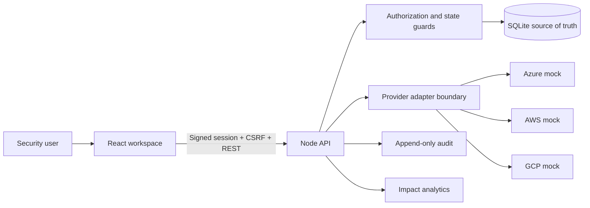
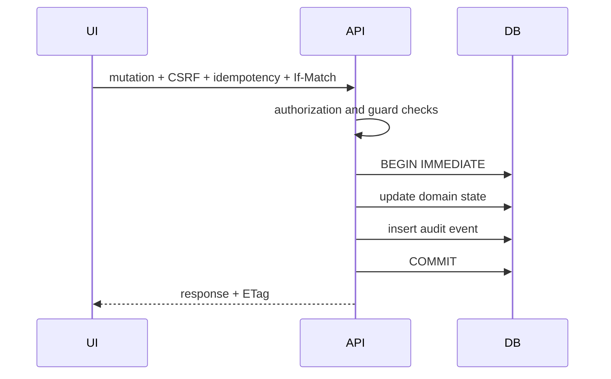

# Architecture

## Context

CSER Workspace is a multi-tenant operations console for fictional cloud workloads and security findings.

## Trust boundaries

1. Browser to API.
2. Authenticated identity to tenant membership.
3. API to persistent workflow state.
4. Domain workflow to mock provider adapters.
5. Transactional state to append-only audit record.

## Request authorization

A protected mutation evaluates:

1. valid signed session;
2. active user membership;
3. active tenant;
4. permission;
5. object's tenant;
6. object-level rule;
7. workflow state guard;
8. separation of duties;
9. optimistic version;
10. idempotency key.

## State change transaction

